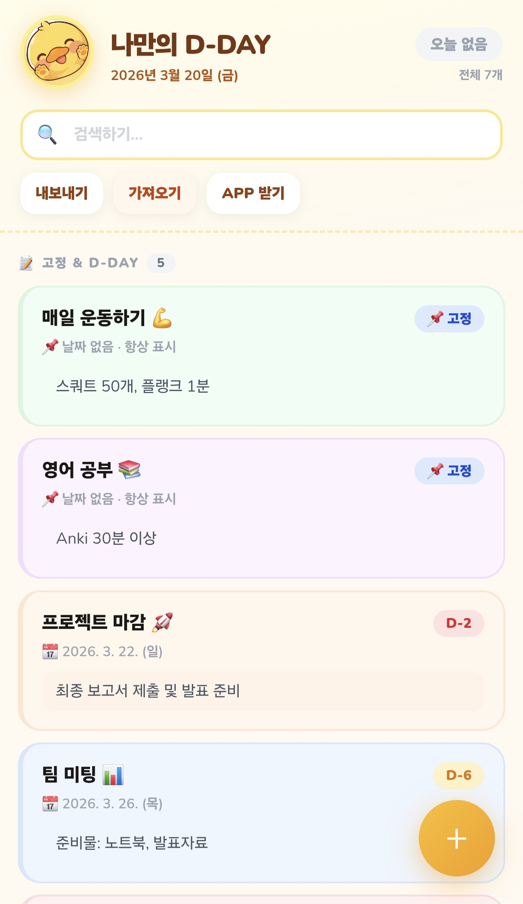
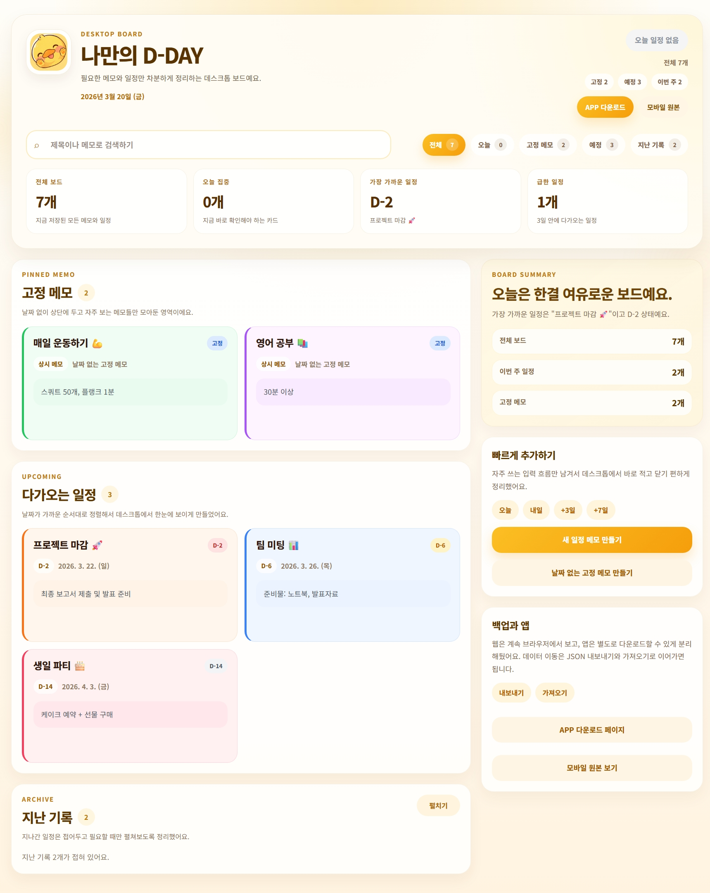
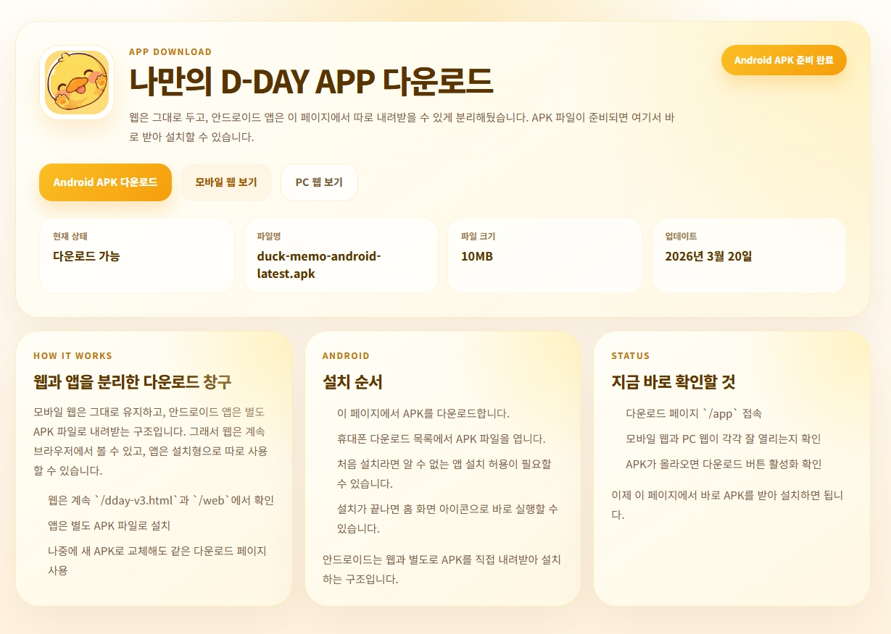

# 나만의 D-DAY

> 안드로이드 앱이 중심인 D-DAY + 메모 프로젝트입니다. 웹은 빠르게 기록하고 정리하기 위한 보조 보드이고, 실제 사용의 중심은 설치형 앱입니다.

<p align="center">
  
</p>

<p align="center">
  <sub>모바일에서는 날짜 없는 메모와 날짜 있는 일정을 한 화면에서 빠르게 확인하고 기록할 수 있습니다.</sub>
</p>

<p align="center">
  
</p>

<p align="center">
  <sub>데스크톱 웹 보드는 더 넓은 화면에서 길게 적고 정리하기 쉽게 만든 보조 입력용 화면입니다.</sub>
</p>

<p align="center">
  
</p>

<p align="center">
  <sub>안드로이드 앱은 별도 다운로드 페이지에서 APK로 바로 설치할 수 있게 정리했습니다.</sub>
</p>

## Try It

- **Mobile (Web)**: [모바일 버전 바로가기](https://my-dday-memo.vercel.app/dday-v3.html)
- **Desktop (Web)**: [데스크톱 웹 보드 바로가기](https://my-dday-memo.vercel.app/web)
- **Android App**: [APK 다운로드 페이지](https://my-dday-memo.vercel.app/app)
- **Dev Write-up**: [블로그 회고 - 날짜 밀릴 때마다 다시 고치기 귀찮아서, 나만의 D-DAY 메모 앱을 만들었다](https://velog.io/@lova-clover/%EB%82%A0%EC%A7%9C-%EB%B0%80%EB%A6%B4-%EB%95%8C%EB%A7%88%EB%8B%A4-%EB%8B%A4%EC%8B%9C-%EA%B3%A0%EC%B9%98%EA%B8%B0-%EA%B7%80%EC%B0%AE%EC%95%84%EC%84%9C-%EB%82%98%EB%A7%8C%EC%9D%98-D-DAY-%EB%A9%94%EB%AA%A8-%EC%95%B1%EC%9D%84-%EB%A7%8C%EB%93%A4%EC%97%88%EB%8B%A4)

## 핵심 방향

- 앱이 메인입니다. 안드로이드 `release APK`까지 만들었고 `/app` 페이지에서 바로 내려받을 수 있습니다.
- 웹은 보조 도구입니다. 모바일 원본 감성은 유지하고, PC에서는 더 넓고 차분한 보드에서 빠르게 입력하고 정리할 수 있게 설계했습니다.
- 동기화보다 개인 사용성을 우선했습니다. 현재는 로컬 저장 기반이고, 기기 간 이동은 JSON 내보내기/가져오기로 이어갑니다.
- 홈 화면 아이콘과 실행 전 스플래시까지 브랜드 로고 기준으로 맞춰 둔 앱 우선 구조입니다.

## 무엇을 할 수 있나

- D-DAY, 고정 메모, 지난 일정, 검색, 색상 카드 관리
- 날짜 없는 메모와 날짜 있는 일정 함께 관리
- 매년 반복 D-DAY 지원
- 모바일 safe area 대응
- 안드로이드 앱 safe area 대응
- JSON 내보내기 / 가져오기
- `/app` 다운로드 페이지를 통한 APK 배포
- 안드로이드 앱 기본 보안 하드닝 반영

## 사용 구조

- `/` : 기기에 따라 모바일 또는 데스크톱 화면으로 자동 분기
- `/dday-v3.html` : 모바일 원본 화면
- `/web` : 데스크톱 입력/정리용 웹 보드
- `/app` : 안드로이드 앱 다운로드 페이지

이 프로젝트는 이렇게 쓰는 흐름이 가장 잘 맞습니다.

1. 휴대폰에서는 앱이나 모바일 화면으로 확인하고 사용합니다.
2. PC에서는 `/web`에서 길게 적고 정리합니다.
3. 앱 설치가 필요하면 `/app`에서 최신 APK를 받습니다.
4. 기기 사이 이동은 JSON 내보내기 / 가져오기로 처리합니다.

## 빠른 시작

```bash
npm install
npm run dev
```

브라우저에서 `http://localhost:3000`으로 접속하면 됩니다.

## 안드로이드 앱 빌드

앱 관련 자세한 문서는 [`native-app/README.md`](native-app/README.md)에 정리되어 있습니다.

빠른 빌드 순서는 아래와 같습니다.

```bash
cd native-app
npm install
npm run android:build:release
npm run apk:publish
```

빌드가 끝나면 APK는 아래 경로로 복사됩니다.

```text
public/downloads/duck-memo-android-latest.apk
```

이 파일은 `/app` 페이지에서 자동으로 다운로드 버튼과 연결됩니다.

## 데이터 저장 방식

- 웹: 브라우저 `localStorage`
- 안드로이드 앱: 앱 내부 WebView 저장소
- 자동 동기화: 현재 없음
- 수동 이전: JSON 내보내기 / 가져오기

즉, 지금은 클라우드 협업 서비스보다는 `내가 직접 설치해서 쓰는 개인용 D-DAY 앱`에 더 가깝습니다.

## 보안 상태

현재 안드로이드 앱에는 아래 항목이 반영되어 있습니다.

- `allowBackup=false`
- Android 백업 / 데이터 추출 제외 규칙
- 앱 빌드 시 서비스워커 제거
- 앱 빌드 시 외부 Google Fonts 요청 제거
- 앱 전용 Content Security Policy 추가
- `release APK` 빌드 후 다운로드 파일로 배포

주의할 점도 있습니다.

- 데이터는 암호화 저장소가 아니라 앱 내부 저장소 기반입니다.
- 앱을 삭제하면 내부 데이터도 함께 사라질 수 있습니다.
- 더 강한 보안이 필요하면 다음 단계는 암호화 저장소 전환입니다.

## 기술 스택

- Next.js 16
- React 19
- 정적 모바일 HTML + JavaScript
- Capacitor Android
- Vercel

## 프로젝트 구조

```text
app/
  page.js                # 모바일/데스크톱 자동 분기
  web/page.js            # 데스크톱 웹 보드
  app/page.js            # APK 다운로드 페이지
components/
  duck-memo-web.js       # 데스크톱 웹 UI
docs/
  images/                # README 스크린샷
public/
  dday-v3.html           # 모바일 원본 UI
  my-dday-logo.png       # 브랜드 로고
  downloads/             # APK 다운로드 파일
native-app/
  android/               # Capacitor Android 프로젝트
  scripts/               # 웹 자산 동기화 / APK 배포 스크립트
```

## 현재 상태

- 브랜딩: `나만의 D-DAY`
- 앱 다운로드 페이지 구축 완료
- 안드로이드 앱 `release APK` 빌드 완료
- 모바일 / 앱 safe area 대응 완료
- 보안 하드닝 1차 완료

실사용, 개인 배포, Vercel 공개까지 가능한 상태입니다.

## 라이선스

- 코드: [MIT 스타일 사용 허용](LICENSE) 기준
- 브랜드 로고, 스크린샷, APK 바이너리 등 미디어 자산: 별도 권리 보유

자세한 조건은 [LICENSE](LICENSE)를 확인하면 됩니다.
